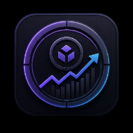

<div align="center">



# Project Token ROI

**Local-first analytics for AI coding-agent token spend — attributed to the projects it was spent on, and measured against the value those projects produced.**

Made with ♥ by [@RemisierSyazwan](https://www.threads.com/@remisiersyazwan)

</div>

```bash
npx token-roi
```

That is the whole setup. It finds the AI coding history already on your machine, indexes it, and opens the dashboard at <http://127.0.0.1:4783>.

---

## What it does

It reads the history files the agent CLIs already write on your machine, normalises them into one event schema, prices them from an editable pricing registry, maps each event to a project by working directory, and reports cost, value and ROI.

It answers questions like:

- How many tokens did each project actually consume, and what would that have cost at list API prices?
- Am I saving money on my subscriptions, or paying a premium?
- Which projects have returned more than they cost, and which have not?
- Where am I burning tokens without producing anything of value?

### Principles

- **No accounts, no cloud, no sync, no telemetry, no analytics beacons, no remote fonts.** The app makes zero outbound network requests.
- **Read-only toward every AI history file.** It never writes to, moves, or deletes them.
- **All state lives in one local SQLite file you own.**
- **The HTTP server binds to `127.0.0.1` only**, on port `4783`.
- **Honest about gaps.** A model with no price is reported as *unpriced* and excluded from totals — never silently priced at zero. A project with no recorded value shows no ROI, rather than −100%.

---

## Automatic indexing

On first launch the app indexes every **verified** source it finds, so the dashboard has real data immediately without you hunting for a Scan button.

What that means concretely:

- Only the history directories of AI tools you already have installed are read, and only if the file format verifies.
- Files are opened read-only. Nothing is modified.
- Nothing leaves the machine.
- The generic JSON/CSV importers are **never** auto-run — they only ever touch a file you pick yourself.

A notice on first run states exactly this. You can turn it off in **Settings › Scanning → Automatic indexing**, after which nothing is read until you press Rescan. Re-indexing is incremental: a rescan of ~300 files that initially took 3.1 s takes ~0.2 s once checkpoints exist.

---

## Supported sources

Only formats verified against real local files are registered (`src/lib/adapters/registry.ts`). All three CLI adapters were tested against the author's own history and ingested roughly 29,900 events.

| Source id | Product | Location | Status |
|---|---|---|---|
| `claude-code` | Claude Code session history | `~/.claude/projects/<encoded-cwd>/<uuid>.jsonl` | Verified |
| `codex` | OpenAI Codex CLI rollouts | `~/.codex/sessions/YYYY/MM/DD/rollout-*.jsonl` | Verified |
| `gemini-cli` | Gemini CLI chat history | `~/.gemini/tmp/<projectDir>/chats/session-*.jsonl` | Verified |
| `generic-jsonl` | Any JSON array / JSONL file | file you select explicitly | User-supplied |
| `generic-csv` | Any CSV export | file you select explicitly | User-supplied |

The two generic importers never auto-discover anything. They only operate on a path you hand them (`TOKEN_ROI_IMPORT_FILE`).

### Deliberately not supported

| Source | Why not |
|---|---|
| Cursor | Local Cursor state was inspected and contains no per-request token accounting; usage is only visible in the vendor dashboard. |
| Anthropic console usage export | No export file was available locally to verify the column layout. Use the Generic CSV importer. |
| OpenAI usage export | Same reason. Use the Generic CSV importer. |
| OpenRouter usage export | No local export was present to verify against. Use the Generic CSV importer. |

These are listed in the app rather than silently omitted, so an absent adapter reads as a decision instead of a gap. See `docs/data-sources.md`.

---

## Known data limitations

These are properties of the source formats, not of the app. Nothing is invented to fill them.

| Limitation | Detail |
|---|---|
| No per-request duration | None of the three verified sources records request latency. `duration_ms` stays NULL. |
| No provider-reported cost | None of the three records a billed amount. Cost is always *calculated* from the pricing registry, never read from the provider. |
| Reasoning tokens are partial | Only `codex` (`reasoning_output_tokens`) and `gemini-cli` (`thoughts`) report them. Claude Code does not break them out. |
| Cache-write tokens are partial | Only `claude-code` reports cache creation (`cache_creation_input_tokens`). Codex and Gemini do not distinguish it. |
| Prompt text is partial | Codex has no reliable per-request prompt text, so no preview is ever stored for it. |
| Unpriceable models | A model with no matching pricing row yields cost NULL — never zero — and is excluded from cost totals with a coverage warning. |

Full per-source field matrices are in `docs/data-sources.md`.

---

## Installation

Requires **Node 20 or newer**. Node 20 or 22 LTS is recommended — see the native-module note below.

### Run it without installing (recommended)

```bash
npx token-roi
```

Useful flags:

```bash
npx token-roi --port 5000     # serve on a different port
npx token-roi --db ./roi.db   # use a specific database file
npx token-roi --scan          # index in the terminal, print a report, exit
npx token-roi --no-open       # do not launch a browser
npx token-roi --help
```

### Install globally

```bash
npm install -g token-roi
token-roi          # or: project-roi
```

### Run from source

```bash
git clone <repo-url> project-token-roi
cd project-token-roi
npm install
npm run db:migrate
npm run dev
```

Then open <http://127.0.0.1:4783>.

### Important: better-sqlite3 native install caveat

`better-sqlite3` is a native module. It ships prebuilt binaries for **Node 20 and 22 LTS**, where installation is instant. On odd-numbered/current releases (Node 21, 23, 25…) no prebuild exists, so it compiles from source — which needs a C++ toolchain and takes a minute or two. If `npx token-roi` seems to hang on first run, that is what it is doing.

Prefer Node 20 or 22 LTS if you want a fast, dependency-free install. The CLI checks this on startup and tells you exactly what to do if the module fails to load.

It must also run its install script to produce that binary, and **npm 11 blocks native install scripts by default.**

If `npm install` prints an `allow-scripts` warning, or anything later fails with `Could not locate the bindings file` / `invalid ELF header` / `NODE_MODULE_VERSION` mismatch, run:

```bash
npm rebuild better-sqlite3 --foreground-scripts
```

(verified working on Node 23 / Windows 11), or approve the scripts once:

```bash
npm approve-scripts
```

Nothing in the app works before this succeeds — every page reads from SQLite.

### Scripts

| Script | Does |
|---|---|
| `npm run dev` | Next dev server on `127.0.0.1:4783` |
| `npm run build` | Production build |
| `npm run start` | Production server on `127.0.0.1:4783` |
| `npm run lint` | ESLint |
| `npm run typecheck` | `tsc --noEmit` |
| `npm test` | Vitest unit tests |
| `npm run test:e2e` | Playwright end-to-end tests |
| `npm run db:migrate` | Apply ordered SQL migrations to the database |
| `npm run scan` | CLI: migrate, seed pricing, detect sources, scan every **verified** source |

`npm run scan` accepts optional source ids, e.g. `npm run scan -- codex gemini-cli`. With no arguments it scans every source whose `detect()` returned `verified`. Sources that detect as `detected-unverified` or `absent` are listed with their reason and skipped.

---

## Running

Both `dev` and `start` are pinned to `-H 127.0.0.1 -p 4783`. The port is not configurable through a flag in `package.json`; to change it, edit the script. Binding to the loopback interface is intentional — the app is not designed to be exposed on a network.

### Screens

| Route | What it is for |
| --- | --- |
| `/` | Overview: metric cards, token volume, model distribution, cost allocation, API vs subscription, project ROI ranking, cost/value scatter, cumulative value vs cost, recent traces |
| `/projects` | Register project folders; assign unmatched sessions |
| `/projects/<id>` | Project detail — tabs: Summary, Token Usage, Sessions, Models, Cost, Value, ROI, Git Activity, Settings |
| `/sessions` | Trace explorer with filters, search, cursor pagination and a per-trace detail drawer |
| `/models` | Model and provider usage, efficiency, and the unpriced-model list |
| `/costs` | API-equivalent vs allocated cash cost, effective rates, breakdowns |
| `/roi` | Focus recommendations, portfolio matrix, ROI rankings, data-gap lists |
| `/sources` | Data Sources: adapter status, completeness, scan history, rescan/disable/remove |
| `/settings` | Tabs: General, Appearance, Privacy, Pricing, Subscriptions, Scanning, Data |

The top bar carries the workspace logo, global project filter, date range, cost-basis selector, search, an index/refresh button and a settings shortcut. The **cost basis** selected there (API Equivalent / Allocated Cash / Blended) drives every ROI figure in the application, and each page states which basis it is using.

## Database location

```
%USERPROFILE%\.project-token-roi\token-roi.db
```

(`~/.project-token-roi/token-roi.db` on macOS/Linux.) Override with the `TOKEN_ROI_DB` environment variable, which both `src/db/client.ts` and `src/db/migrate.ts` honour.

The connection opens with:

| Pragma | Value |
|---|---|
| `journal_mode` | `WAL` |
| `synchronous` | `NORMAL` |
| `foreign_keys` | `ON` |

WAL means the directory will also contain `token-roi.db-wal` and `token-roi.db-shm`.

### Environment variables

| Variable | Effect |
|---|---|
| `TOKEN_ROI_DB` | Full path to the SQLite file |
| `TOKEN_ROI_CLAUDE_ROOT` | Replaces `~/.claude/projects` |
| `TOKEN_ROI_CODEX_ROOT` | Replaces `~/.codex/sessions` |
| `TOKEN_ROI_GEMINI_ROOT` | Replaces `~/.gemini/tmp` |
| `TOKEN_ROI_IMPORT_FILE` | The single file the generic JSONL/CSV importers operate on |

The root overrides exist so tests (and curious users) can point the adapters at fixture directories without touching real history.

## Backup

Stop the app first so the WAL is checkpointed, then copy the whole directory:

```powershell
# Windows
Copy-Item "$env:USERPROFILE\.project-token-roi" "$env:USERPROFILE\token-roi-backup" -Recurse
```

```bash
# macOS / Linux
cp -R ~/.project-token-roi ~/token-roi-backup
```

Copy `token-roi.db` **together with** `-wal` and `-shm` if the app was running. Restoring is the reverse copy. Because history files are only ever read, a lost database costs you your projects, subscriptions, value entries and pricing edits — the token events themselves can be rebuilt with `npm run scan`.

---

## Using it

### Adding a project

A project is a name plus a filesystem path. Attribution is by working directory: every event carries the `cwd` recorded by the CLI, and the matcher (`src/lib/projects/match.ts`) resolves it in this precedence:

1. **exact** — the normalised cwd equals the project path or its git root
2. **child** — the cwd is nested inside a project root; the *deepest* matching root wins, so a nested project beats its parent
3. **remote** — normalised git remote URL matches
4. **manual** — a mapping rule (`prefix` or `exact`) you added
5. **unassigned** — `project_id` stays NULL

Paths are normalised hard before comparison: backslashes to forward slashes, trailing slashes stripped, drive letter lower-cased, whole string lower-cased. Windows path-case differences never cause a miss.

After adding or editing a project, re-run mapping (`remapProjects()`) to re-attribute existing events. You do not need to re-scan.

### Configuring subscriptions

A subscription records what you actually pay: `monthly_price`, `seats`, `billing_cycle` (`monthly` / `quarterly` / `annual`), `discount_pct`, `tax_pct`, an active window, and an allocation method. The effective monthly cash cost is:

```
base       = monthly_price * max(1, seats)
perMonth   = base / 12  (annual)  |  base / 3  (quarterly)  |  base  (monthly)
monthlyCash = perMonth * (1 - discount_pct/100) * (1 + tax_pct/100)
```

That figure is then spread across projects by one of six methods (`token_share`, `session_share`, `active_day_share`, `equal`, `manual_pct`, `direct`). Anything not attributable — usage by unassigned sessions, or manual percentages summing below 100 — is reported as `unallocated` and is **never silently redistributed**. See `docs/subscription-allocation.md`.

### Entering project value

Value is recorded as `value_events` rows against a project: an amount, a currency, a date, a type, and two honesty flags:

- `realised` — money/benefit that actually landed, versus an estimate.
- `confidence` — `low` / `medium` / `high`.

A value event can be `recurring` with a period of `weekly`, `monthly`, `quarterly` or `yearly` and an optional end date. Recurring entries are expanded per occurrence into the reporting window, so a $500/month retainer entered once contributes to every month rather than one lump on its start date.

All money is stored in USD. Display in another currency uses a manually entered rate (`general.usdToMyr`) applied at render time.

### Understanding ROI

```
net value    = value - cost
ROI %        = ((value - cost) / cost) * 100
ROI multiple = value / cost
```

Three cost bases are selectable (`costBasis` setting):

| Basis | Cost used |
|---|---|
| `api_equivalent` | What this usage would have cost at list API prices |
| `allocated_cash` | The share of real subscription spend attributed to the project |
| `blended` | Real cash paid **plus** the API price of usage no subscription covered |

Zero cost is not infinite ROI: when cost is zero or missing, the app reports net value only and labels the reason (`no_cost`, `cost_unknown`, `no_value`) rather than emitting `Infinity` or `NaN`. Full derivations, break-even, payback period, value per million tokens, and the deterministic Double Down / Maintain / Validate Further / Reduce Spend / Pause / Insufficient Data scoring are in `docs/roi-methodology.md`.

**This is a bookkeeping tool, not financial advice.** Correlation between AI usage and business results is not causation.

### Resetting the app

| Goal | Action |
|---|---|
| Re-read everything from scratch | Delete rows from `scan_checkpoints`, then `npm run scan`. Existing events dedup by `event_id`, so nothing duplicates. |
| Drop indexed token events, keep projects/values/pricing | Delete from `events` (and optionally `scan_checkpoints`, `scan_runs`). |
| Full reset | Stop the app, delete `token-roi.db`, `-wal` and `-shm`, then `npm run db:migrate`. |

Deleting the database never touches your AI history files. See `docs/privacy.md`.

---

## Troubleshooting

The common failures — native build failure, port 4783 already in use, migration failure, no sources detected, unpriced models, permission-denied or locked source files, corrupt records, unassigned sessions — are covered in `docs/troubleshooting.md`.

## Documentation

| Document | Contents |
|---|---|
| `docs/architecture.md` | Layers, dataset partition, incremental indexing, performance choices |
| `docs/data-sources.md` | Verified record shapes and completeness per source |
| `docs/cost-calculation.md` | Pricing registry, resolution rules, formulas |
| `docs/subscription-allocation.md` | The six allocation methods and the three cost bases |
| `docs/roi-methodology.md` | ROI formulas and the recommendation engine |
| `docs/privacy.md` | What is read, what is stored, what is redacted |
| `docs/troubleshooting.md` | Failure modes and fixes |
| `docs/adding-an-adapter.md` | How to add a source, and the verification rule |

---

## Testing

| Suite | Command | Count |
|---|---|---|
| Unit + integration (Vitest) | `npm test` | 173 |
| End-to-end (Playwright) | `npm run test:e2e` | 12 |

Unit tests cover token normalisation per adapter, deduplication, corrupt-record tolerance, project path matching, date-effective pricing, subscription allocation, ROI maths and zero-cost handling, recurring value expansion, and the deterministic recommendation scorer. End-to-end tests drive the real app: automatic indexing, adding a project, recording value, subscriptions, trace filtering, CSV export and chart rendering.

Each e2e run gets its own throwaway database and fixture-backed sources, so it never touches real data.

---

## Credits

Built by **[@RemisierSyazwan](https://www.threads.com/@remisiersyazwan)**.

If this helped you understand where your AI budget actually goes, a mention is always welcome.

## Licence

Open source. See `LICENSE`.
